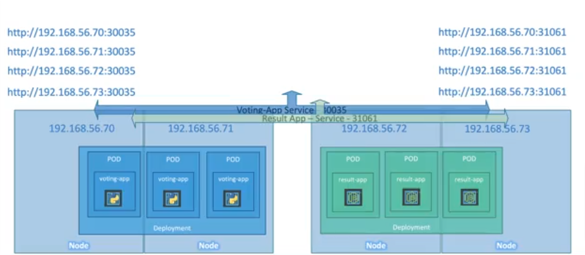

# Core Concept - Kubernetes Architecture

### etcd

* etcd - It is a distributed, reliable, key-value store that is simple, secure, and fast.

##### etcd role in k8s

* The etcd data store stores information regarding the cluster such as the notes, pods, convicts, secrets, accounts, roles, role bindings, and others.
* Every change you make to your cluster such as adding additional nodes, deploying pods or replica sets are updated in the etcd server.
* Only once it is updated in the etcd server is the change considered to be complete.
* Port 2379, which is the default port on which etcd listens.

### kube-api server

* kube-api server is the primary management component in Kubernetes.

* When you run a kubectl command, the kubectl utility reaches to the kube-apiserver.
* The kube-api server first authenticates the request and validates it.
* It then retrieves the data from the etcd cluster and responds back with the requested information.
* kube-api server is the only component that intereacts directly with the etcd data store.

So, when a pod is created, kube-scheduler continuously monitors the kube-api server and when it founds the new pod, it assigns the pod to the right node and communicates that back to the kube-api server. The api server updates this information in the etcd cluster. The kubelet then creates the pod on the node and instructs the container runtime engine to deploy the application image. Once done, the kubelet updates the status back to the API server and the API server then updates the data back in the etcd cluster.

### kube scheduler

* The scheduler is only responsible for deciding which pod goes on which node. It doesn't actually place the pod on the nodes, that's the job of the kubelet.
* The scheduler looks at each pod and tries to find the best node for it.
* The scheduler tries to filter out the nodes that do not fit the profile for this pod. For example, the nodes that do not have sufficient CPU and memory resources requested by the pod.
* The scheduler ranks the nodes to identify the best fit for the pod. It uses a priority function to assign a score to the nodes on a scale of zero to 10. For example, the scheduler calculates the amount of resources that would be free on the nodes after placing the pod on them.

### kubelet

* The kubelet in the Kubernetes worker node registers the node with a Kubernetes cluster.
* When it receives instructions to load a container or a pod on the node, it requests the container runtime engine, which may be Docker, to pull the required image and run an instance.
* The kubelet then continues to monitor the state of the pod and containers in it and reports to the kube API server on a timely basis.
* With help of kubelet a node can join the cluster and tell the cluster that it is available to run the workload.
* Kubelet talks to the control plane to get the pods list that needs to run on the node and runs the pod. It also does a health check on containers and tells the status back to API server.

### Kube Proxy

* A pod network is an internal virtual network that expands across all the nodes in the cluster to which all the pods connect to. Through this network, they're able to communicate with each other.
* Kube-proxy is a process that runs on each node in the Kubernetes cluster. Its job is to look for new services, and every time a new service is created, it creates the appropriate rules on each node to forward traffic to those services to the backend pods.

### Pods

* Kubernetes does not deploy containers directly on the worker nodes.
* The containers are encapsulated into a Kubernetes object known as pods.
* A pod is a single instance of an application.
* A pod is the smallest object that you can create in Kubernetes.
* To scale up, you create new pods, and to scale down, you delete existing pods. You do not add additional pods to an existing container to scale your application.
* The pod has a one-to-one relationship with the containers.

### Replicaset

### Deployment

* Deployment is an object that provides declarative updates to applications.
* It allows you to describe the desired state of your application's pods, and the Deployment controller changes the actual state to the desired state at a controlled rate.
* Deployments are a key resource for managing applications in a Kubernetes cluster.

##### Features and components of a Kubernetes Deployment

* **Pod Template** - A Deployment specifies the desired state through a Pod template. This template describes the characteristics of the pods that should be created, including the container image, ports, and other settings.
* **Replica Sets** - Deployments use Replica Sets underneath to ensure the desired number of replicas (pod instances) are maintained. The Replica Set helps manage the scaling of pods and ensures high availability.
* **Rolling Updates** - One of the powerful features of Deployments is the ability to perform rolling updates. When you want to update your application to a new version or configuration, a Deployment can manage the update process without downtime. It gradually replaces old pods with new ones, ensuring a smooth transition.
* **Rollback** - If an update causes issues or if you need to revert to a previous version, Deployments support rollback functionality. You can easily roll back to a previous known good state, minimizing the impact of issues.
* **Scaling** - If a pod or node fails, the Deployment controller automatically replaces the failed pod with a new one, ensuring the desired number of replicas is maintained.
* **Declarative Configuration** - Deployments are defined using declarative YAML or JSON configuration files. You describe the desired state, and the Deployment controller works to make the actual state match the specified state.

### Services

* Kubernetes 'Services' enable communication between various components within and outside of the application.
* Kubernetes 'Services' help us connect applications with other applications or users.
* 'Service' also helps in connecting the group of pods.

* Types of Services - NodePort, ClusterIP & LoadBalancer.

##### Services - ClusterIP

* Description: This is the default type. The clusterIP make the pod accessible internally to other pods by assigning an IP to it. Other pods within the same cluster can communicate with this service using the ClusterIP, but external traffic from outside the cluster cannot reach this service directly using the ClusterIP. This provides a way for pods within the cluster to interact with the service without exposing it to external networks.
* Use Case: It is used for communication between different components within the cluster. For example, if you have a frontend and backend service, the frontend can communicate with the backend using a ClusterIP service.
* How it works:

  * Kubernetes assigns a virtual IP (ClusterIP) to the service.
  * Internal DNS automatically resolves the service name to this IP within the cluster.
  * Traffic to the service is load-balanced across pods matching the service's selector.
* Example

  

  * Use a definition file with API version, kind (service), metadata, and spec (including type, ports, and selector).
  * Specify the target port (exposed by the backend) and the port for the service (exposed for access).
  * Link the service to pods using selectors, copying labels from the pod definition file.
  * For example, if you have a pod running a web server listening on port 8080, and you want other pods in the cluster to access this web server through a Service, you would set:
  * port: 80 (the Service's port)
  * targetPort: 80 (the pod's container port)
  * This setup ensures that requests made to the Service's port 80 are forwarded to the pod's container port 8080, allowing seamless communication within the cluster.
* **Port**: This is the port number that the Service will listen on within the cluster. Other pods or services can access the Service using this port.
* **TargetPort**: This is the port number on which the pod's container is listening. The Service forwards incoming traffic on its own port to this targetPort of the pod, effectively routing requests to the correct container.

##### Services - NodePort

* Description: This type exposes the service on each node's IP at a static port. It allows external users to access the service by connecting to any node in the cluster on the specified port.
* Use Case: It is commonly used when you need to expose the service to external users or systems. For example, if you have a web application, you can use NodePort to allow external users to access it
* How it works:
  * In addition to a ClusterIP, NodePort assigns a static port (e.g., 30000-32767) on each node to the service.
  * External traffic hitting any node's IP on the NodePort is forwarded to the ClusterIP and then to the corresponding pods.

##### Services - LoadBalancer

* Description: This type provisions an external load balancer (e.g., cloud load balancer) and assigns a stable external IP to the service. Traffic to this external IP is then routed to the service's ClusterIP.
* Use Case: It is suitable for scenarios where you need external access and want to distribute traffic across multiple nodes using a load balancer. This type is often used in cloud environments where native load balancers are available.
* How it works:
  * LoadBalancer creates an external load balancer (e.g., provided by cloud providers) and assigns an external IP to the service.
  * The load balancer distributes incoming traffic across nodes running the service based on load balancing algorithms.

* Example
  * In Kubernetes, using services we can access both the application( voting-app and result-app) with any IP address. It means that with the IP Address 192.168.56.72(IP of one of the nodes of result-app), you can access the voting-app! But the problem is users don't want this much number of IP Addresses, it only wants a single IP Address.
  * In a Kubernetes cluster, multiple instances of an application may run across different nodes.
  * Load balancer services help distribute incoming traffic across these instances to optimize performance and prevent overload on any single instance
* Features
  * LoadBalancer services provision external load balancers in supported cloud environments - GCP, AWS and Azure.
  * They automatically distribute incoming traffic across instances based on predefined algorithms.

### Namespaces

* Kubernetes NameSpaces provide isolation and unique identity within a cluster.
* NameSpaces segregate resources and define access policies within a cluster.
* Useful for separating development and production environments within the same cluster.
* Each NameSpace can have its own resource quotas, limiting resource consumption.

### Resource Quota

* To limit resources in a name space, create a resource quota.
* To create one, start with a definition file for resource quota, specify the namespace for which you want to create the quota, and then under spec, provide your limits such as 10 pods, 10 CPU units, 10 GB byte of memory, etc.

